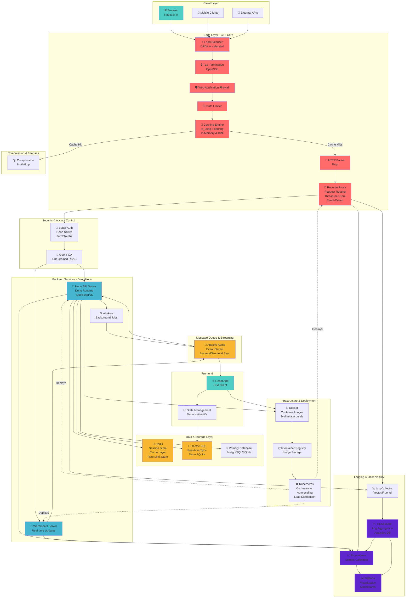

# Marble Architecture Diagram

## Component Breakdown

### Edge Layer (C++ Core) - High Performance
- **io_uring + liburing** for async I/O
- **DPDK** acceleration for packet processing
- **Thread-per-core** with shared-nothing architecture
- **OpenSSL** for TLS termination
- **llhttp** for HTTP parsing
- **In-memory + disk cache** with cache-aside pattern

### Backend (Deno + Hono)
- **Deno runtime** for native TypeScript execution
- **Hono framework** for minimal, fast HTTP server
- **Native Deno KV** for state management
- **WebSocket server** for real-time features

### Security
- **Better Auth**: Deno-native authentication
- **OpenFGA**: Fine-grained RBAC and authorization
- **Rate limiting** at edge layer

### Data Layer
- **Redis**: Session store, cache, rate limit state
- **ElectricSQL**: Real-time sync between backend and frontend
- **SQLite/PostgreSQL**: Primary persistent storage

### Messaging
- **Apache Kafka**: Event streaming for async communication

### Observability
- **Prometheus**: Metrics collection
- **Grafana**: Visualization and dashboards
- **ClickHouse**: Time-series log storage and analytics

### Infrastructure
- **Docker**: Container images with multi-stage builds
- **Kubernetes**: Orchestration, scaling, distribution
