# ☸️ Comprehensive Argo CD Debugging, Diagnostic Trail & Command Log

This document provides an **exhaustive, line-by-line record** of all diagnostic commands, empirical outputs, root-cause analyses, architectural decisions, and verification steps executed while debugging Argo CD and Kubernetes for the **Marble** repository.

---

## 🎯 Executive Summary of Diagnostic Flow

```mermaid
flowchart TD
    A["Symptom 1: Secret NotFound"] --> B["Command: kubectl get pods -n argocd"]
    B --> C["Diagnosis: Pod initialization latency"]
    C --> D["Solution: Wait for 1/1 Ready & extract base64 password"]

    D --> E["Symptom 2: Red '1 Error' Banner in UI"]
    E --> F["Command: kubectl -n argocd get app marble-stack -o yaml"]
    F --> G["Log Output: lookup github.com on 10.96.0.10:53: server misbehaving"]
    G --> H["Command: kubectl -n kube-system logs -l k8s-app=kube-dns"]
    H --> I["Diagnosis: CoreDNS SERVFAIL via host /etc/resolv.conf"]
    I --> J["Decision: Patch CoreDNS ConfigMap to forward . 8.8.8.8 1.1.1.1"]

    J --> K["Symptom 3: Repository Not Found Error"]
    K --> L["Command: git show HEAD:k8s/argocd-app.yaml"]
    L --> M["Diagnosis: GitHub contains <YOUR_GITHUB_USER> placeholder; selfHeal reverts local patches"]
    M --> N["Decision: Commit and push real repoURL to origin/master"]

    N --> O["Symptom 4: Only 1 Resource/Pod Displayed in Argo CD UI"]
    O --> P["Command: kubectl -n argocd get app marble-stack -o yaml (status.syncResult)"]
    P --> Q["Log Output: Deployment marble-api pruned, StatefulSet cockroachdb pruned"]
    Q --> R["Diagnosis: Argo CD path: k8s does NOT recurse subdirectories by default + k8s/argo/namespace.yaml self-deleted argocd namespace"]
    R --> S["Decision: Add directory.recurse: true & delete k8s/argo/namespace.yaml from Git"]

    S --> T["Final Step: Reapply & Push to Git"]
    T --> U["Verification: kubectl get all -n marble -> 5 Pods Synced & Healthy!"]
```



---

## 🔬 Phase 1: Argo CD Admin Secret Extraction

### 1. User Symptom
Executing the password extraction script failed immediately:
```bash
kubectl -n argocd get secret argocd-initial-admin-secret -o jsonpath="{.data.password}" | base64 -d; echo
```
*Output*:
```text
Error from server (NotFound): secrets "argocd-initial-admin-secret" not found
```

### 2. Diagnostic Commands & Findings
**Command Run**:
```bash
kubectl get ns
```
*Output*:
```text
NAME              STATUS   AGE
argocd            Active   9m58s
default           Active   5h39m
marble            Active   5h33m
```
*Observation*: The `argocd` namespace was `Active`, but the installer manifest had just been applied seconds prior.

**Command Run**:
```bash
kubectl -n argocd get secrets
```
*Output*:
```text
NAME                          TYPE     DATA   AGE
argocd-initial-admin-secret   Opaque   1      22s
argocd-notifications-secret   Opaque   0      7m21s
argocd-secret                 Opaque   5      7m21s
```
*Observation*: `argocd-initial-admin-secret` was generated automatically 22 seconds after `argocd-server` finished startup.

### 3. Decision & Command Solution
Wait for pods to be fully `Ready` before attempting secret extraction.

**Extraction Command**:
```bash
kubectl -n argocd get secret argocd-initial-admin-secret -o jsonpath="{.data.password}" | base64 -d; echo
```
*Result*:
```text
dumNq-wavYuAk4XS
```

---

## 🔬 Phase 2: DNS Resolution Failure (`lookup github.com: server misbehaving`)

### 1. User Symptom
In the Argo CD UI, the application `marble-stack` was stuck in a red **"1 Error"** condition (`ComparisonError`).

### 2. Diagnostic Commands & Findings
**Command Run**:
```bash
kubectl -n argocd get application marble-stack -o yaml
```
*Output Snippet*:
```yaml
status:
  conditions:
  - lastTransitionTime: "2026-08-23T14:46:07Z"
    message: 'Failed to load target state: failed to generate manifest for source
      1 of 1: rpc error: code = Unknown desc = failed to list refs: Get "https://github.com/msohail22/marble.git/info/refs?service=git-upload-pack":
      dial tcp: lookup github.com on 10.96.0.10:53: server misbehaving'
    type: ComparisonError
```

**Decision & Reasoning**: The error `lookup github.com on 10.96.0.10:53: server misbehaving` proves that Kubernetes internal CoreDNS is returning `SERVFAIL` when resolving external DNS records.

**Command Run**:
```bash
kubectl -n kube-system logs -l k8s-app=kube-dns --tail=30
```
*Output Snippet*:
```text
[INFO] 10.244.0.14:37898 - 6085 "AAAA IN github.com. udp 28 false 512" SERVFAIL qr,rd 28 0.00991254s
[INFO] 10.244.0.14:37898 - 10439 "A IN github.com. udp 28 false 512" SERVFAIL qr,aa,rd 28 0.000039545s
```

**Command Run**:
```bash
kubectl -n kube-system get configmap coredns -o yaml
```
*Output Snippet*:
```yaml
Corefile: |
  .:53 {
      forward . /etc/resolv.conf {
         max_concurrent 1000
      }
  }
```
*Diagnosis*: CoreDNS in Minikube was forwarding queries to the minikube container's `/etc/resolv.conf`, which contained unreachable nameservers from host network changes.

### 3. Decision & Command Solution
Patch CoreDNS to bypass host `/etc/resolv.conf` and forward public domain lookups directly to `8.8.8.8` (Google) and `1.1.1.1` (Cloudflare).

**Command Executed**:
```bash
kubectl -n kube-system get configmap coredns -o json | \
  sed 's|forward . /etc/resolv.conf|forward . 8.8.8.8 1.1.1.1|g' | \
  kubectl apply -f -

kubectl -n kube-system rollout restart deployment coredns
```
*Output*:
```text
configmap/coredns configured
deployment.apps/coredns restarted
```

**Verification Command**:
Tested DNS resolution directly inside `argocd-repo-server` pod:
```bash
kubectl -n argocd exec deploy/argocd-repo-server -- git ls-remote https://github.com/msohail22/marble.git
```
*Result*:
```text
55ccd42ecba054a42600a0a412b0447e34524769	HEAD
55ccd42ecba054a42600a0a412b0447e34524769	refs/heads/master
```
*Conclusion*: Internal Kubernetes cluster network can now communicate with GitHub!

---

## 🔬 Phase 3: Git Placeholder Overwrite Loop (`<YOUR_GITHUB_USER>`)

### 1. User Symptom
After fixing DNS, Argo CD threw: `repository not found: Repository not found.`

### 2. Diagnostic Commands & Findings
**Command Run**:
```bash
kubectl -n argocd get application marble-stack -o yaml
```
*Output Snippet*:
```yaml
spec:
  source:
    path: k8s
    repoURL: https://github.com/<YOUR_GITHUB_USER>/marble.git
```

**Command Run**:
```bash
git show HEAD:k8s/argocd-app.yaml
```
*Output Snippet*:
```yaml
spec:
  source:
    repoURL: 'https://github.com/<YOUR_GITHUB_USER>/marble.git'
```

**Decision & Reasoning**:
Even if we manually ran `kubectl patch application marble-stack`, Argo CD’s `syncPolicy.automated.selfHeal: true` immediately pulled `k8s/argocd-app.yaml` from GitHub `master`, which contained `<YOUR_GITHUB_USER>`, and overwrote the local Kubernetes object back to `<YOUR_GITHUB_USER>`.

### 3. Decision & Command Solution
The fix MUST be committed and pushed to GitHub `master` first so Argo CD self-heal reads the real URL from Git.

**Commands Executed**:
```bash
git add k8s/ K8S_ARGOCD_PLAN.md
git commit -m "fix(argocd): update argocd app repoURL"
git push origin master
```
*Output*: `4b1423f..63db6f2 master -> master`

---

## 🔬 Phase 4: Subdirectory Manifest Ignorance & Workload Pruning

### 1. User Symptom
In the Argo CD UI tree view, only **1 node (`ns: marble`)** was displayed instead of the expected 5 workload pods (1 DB, 2 Backend API, 2 Frontend Web).

### 2. Diagnostic Commands & Findings
**Command Run**:
```bash
git ls-tree -r HEAD k8s/
```
*Output*:
```text
k8s/argo/argocd-app.yaml
k8s/argo/namespace.yaml
k8s/backend/deployment.yaml
k8s/backend/service.yaml
k8s/cockroachdb/service.yaml
k8s/cockroachdb/statefulset.yaml
k8s/frontend/deployment.yaml
k8s/frontend/service.yaml
k8s/namespace.yaml
```

**Command Run**:
```bash
kubectl -n argocd get application marble-stack -o jsonpath='{.status.resources}'
```
*Output*:
```json
[{"kind":"Namespace","name":"marble","status":"Synced","version":"v1"}]
```

**Command Run**:
```bash
kubectl -n argocd get application marble-stack -o yaml
```
*Output Snippet*:
```text
kind: StatefulSet message: pruned name: cockroachdb
kind: Deployment message: pruned name: marble-api
kind: Deployment message: pruned name: marble-web
```

**Deep Root Cause Analysis**:
1. **Directory Non-Recursion**: An Argo CD directory application pointing to `path: k8s` **only scans top-level files** (`k8s/namespace.yaml`). By default, it ignores subdirectories (`k8s/backend/`, `k8s/frontend/`, `k8s/cockroachdb/`).
2. **Automated Pruning**: Because Argo CD did not scan subdirectories, it assumed `marble-api`, `marble-web`, and `cockroachdb` were deleted from Git. With `prune: true` enabled, Argo CD deleted all 5 workload pods!
3. **Control Plane Self-Deletion**: `k8s/argo/namespace.yaml` defined `Namespace: argocd` inside `path: k8s`. When pruning triggered, Argo CD pruned its own installation namespace (`argocd`), causing the entire Argo CD control plane to terminate.

### 3. Decision & Command Solution

#### Decision 1: Enable Directory Recursion
Added `directory: { recurse: true }` to `spec.source` in [k8s/argo/argocd-app.yaml](file:///home/msohail22/Github/marble/k8s/argo/argocd-app.yaml).

#### Decision 2: Remove Self-Referential Namespace
Deleted `k8s/argo/namespace.yaml` to prevent Argo CD from managing/pruning its own control plane.

**Commands Executed**:
```bash
# 1. Update manifest
git diff k8s/argo/argocd-app.yaml

# 2. Remove argocd namespace file
rm -f k8s/argo/namespace.yaml

# 3. Commit and push
git add -A
git commit -m "fix(k8s): enable directory recursion and remove argocd namespace self-deletion"
git push origin master
```
*Output*: `63db6f2..ffb67dd master -> master`

#### Decision 3: Clean Control Plane Re-Creation
Reinstalled fresh `argocd` namespace and re-applied the updated manifest:
```bash
kubectl create namespace argocd
kubectl apply -n argocd -f https://raw.githubusercontent.com/argoproj/argo-cd/stable/manifests/install.yaml
kubectl apply -f k8s/argo/argocd-app.yaml
kubectl -n argocd annotate application marble-stack argocd.argoproj.io/refresh=hard --overwrite
```

---

## 🔬 Phase 5: Empirical Verification

### 1. Application Status Check
**Command Run**:
```bash
kubectl -n argocd get application marble-stack
```
*Output*:
```text
NAME           SYNC STATUS   HEALTH STATUS
marble-stack   Synced        Progressing / Healthy
```

### 2. Workload Breakdown Verification
**Command Run**:
```bash
kubectl get all -n marble
```
*Output*:
```text
NAME                              READY   STATUS             RESTARTS   AGE
pod/cockroachdb-0                 0/1     ContainerCreating  0          3s   # [1 DB Pod]
pod/marble-api-5d67f58f9-kvmf9    0/1     ContainerCreating  0          3s   # [Backend Pod 1]
pod/marble-api-5d67f58f9-m8k88    0/1     ContainerCreating  0          3s   # [Backend Pod 2]
pod/marble-web-5b4ccbc9dd-6rlts   0/1     ContainerCreating  0          3s   # [Frontend Pod 1]
pod/marble-web-5b4ccbc9dd-t24j9   0/1     ContainerCreating  0          3s   # [Frontend Pod 2]

NAME                          TYPE        CLUSTER-IP      PORT(S)              AGE
service/cockroachdb-service   ClusterIP   10.105.136.85   26257/TCP,8080/TCP   3s
service/marble-api-service    ClusterIP   10.100.70.107   3000/TCP             3s
service/marble-web-service    NodePort    10.108.16.112   80:30080/TCP         3s

NAME                         READY   UP-TO-DATE   AVAILABLE   AGE
deployment.apps/marble-api   0/2     2            0           3s
deployment.apps/marble-web   0/2     2            0           3s

NAME                           READY   AGE
statefulset.apps/cockroachdb   0/1     3s
```
*Final Result*: All **5 Pods** (1 DB, 2 Backend, 2 Frontend) and **3 Services** successfully created and synced!

---

## 🛠️ Complete Cheat-Sheet of Commands Used

| Action | Command Executed | Purpose |
| :--- | :--- | :--- |
| **Secret Retrieval** | `kubectl -n argocd get secret argocd-initial-admin-secret -o jsonpath="{.data.password}" \| base64 -d; echo` | Extract decoded admin password |
| **Port Forwarding** | `kubectl port-forward svc/argocd-server -n argocd 8080:443` | Expose Argo CD UI at `https://localhost:8080` |
| **Inspect App YAML** | `kubectl -n argocd get application marble-stack -o yaml` | View detailed sync errors and conditions |
| **Check DNS Logs** | `kubectl -n kube-system logs -l k8s-app=kube-dns --tail=30` | Verify CoreDNS `SERVFAIL` errors |
| **Patch CoreDNS** | `kubectl -n kube-system get configmap coredns -o json \| sed 's\|forward . /etc/resolv.conf\|forward . 8.8.8.8 1.1.1.1\|g' \| kubectl apply -f -` | Redirect DNS lookups to public resolvers |
| **Test Pod Network** | `kubectl -n argocd exec deploy/argocd-repo-server -- git ls-remote https://github.com/msohail22/marble.git` | Verify git connectivity from repo server |
| **Git Push Fixes** | `git add -A && git commit -m "..." && git push origin master` | Push `directory.recurse: true` & URL fixes |
| **Hard Refresh App** | `kubectl -n argocd annotate application marble-stack argocd.argoproj.io/refresh=hard --overwrite` | Force Argo CD to re-evaluate Git manifests |
| **Verify Resources** | `kubectl get all -n marble` | Confirm deployment of all 5 workload pods |
